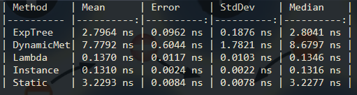
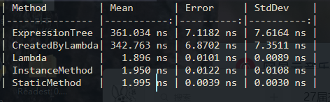
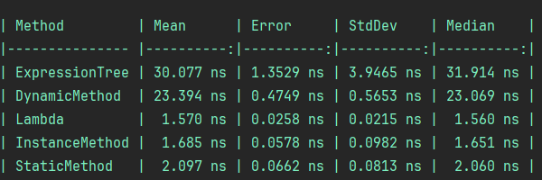

The old version is based on .NET Framework, which means it's out of date and with poor performance , but can run in most of computers which is of Windows System. \
旧版本基于 .NET Framework，这意味着它过时且性能较差，但可以在大多数 Windows 系统的计算机上运行。

The implicit function plotting part of the sketchpad can draw implicit functions with 2 variables \
It's an open source alternative to Grafeq. \
It is based on Reliable Two-Dimensional Graphing Methods for Mathematical Formulae with Two Free Variables by Jeff
Tupper of University of Toronto, SIGGRAPH 2001. \
It implements the Jeff Tupper's algorithms before Branch Cut Tracking or Algorithm 3.2.\
几何画板的隐函数绘图部分可以绘制带有两个变量的隐函数。它是 Grafeq 的开源替代品。\
其基于多伦多大学的 Jeff Tupper 在 2001 年 SIGGRAPH 上的论文 Reliable Two-Dimensional Graphing Methods for Mathematical Formulae with Two Free Variables。它实现了分支切割跟踪或算法 3.2 之前的算法。 \
[查看更多](Example.md)\
[论文](https://www.dgp.toronto.edu/~mooncake/msc.html)\

The program use dynamic compilation to accelarate the calculation of implicit functions. If you are concerned about the performance of dynamic compilataion, you can check out my another relative project. \
该程序使用动态编译来加速隐函数的计算。如果您关心动态编译的性能，可以查看我另一个相关项目。 \
It's obvious that the performance of the AOT program is very poor. Expression Tree might run in the form of explanation. However, using such algorithm to render function may consumes a large amount of computing power, so I will probably implement a small simple interpreter based on a stack to make it faster.\
很显然AOT下程序会以解释的形式运行，效率很差。 然而使用该算法会消耗大量算力，于是我打算在之后实现一个小型简单解释器以加速。 \
.NET Core JIT:\
\
.NET Core AOT\
\
.NET Framework\
\