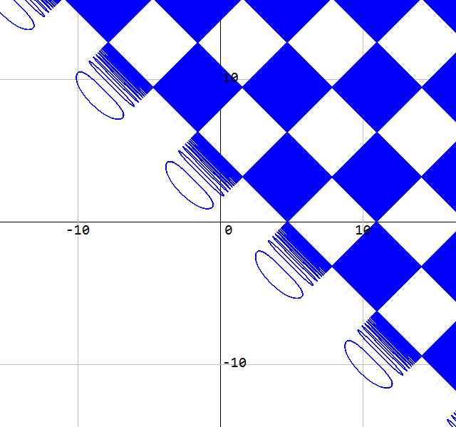
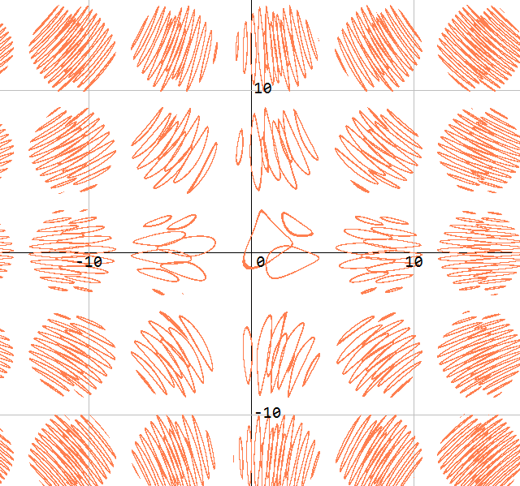
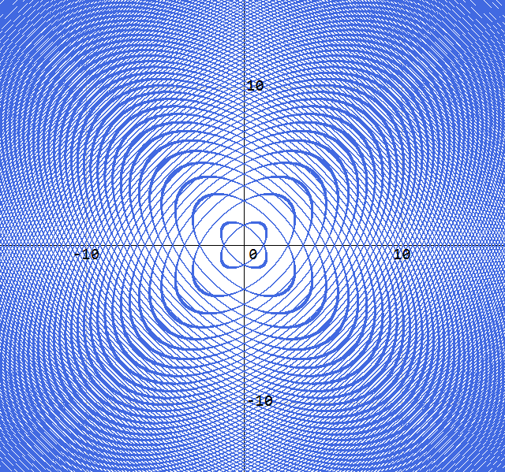
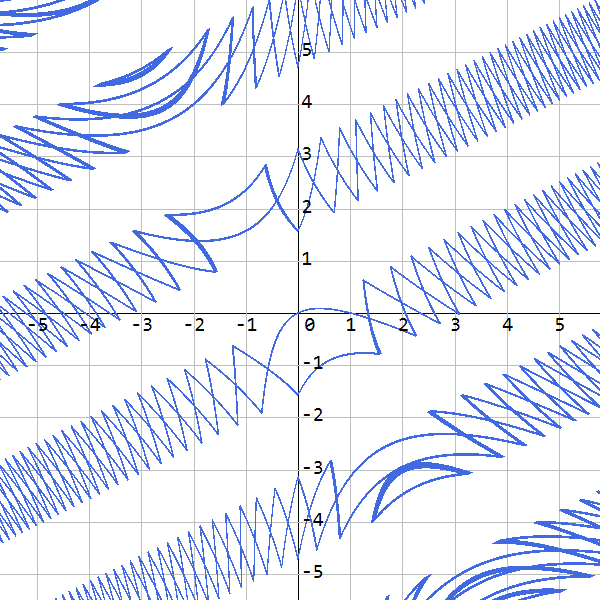
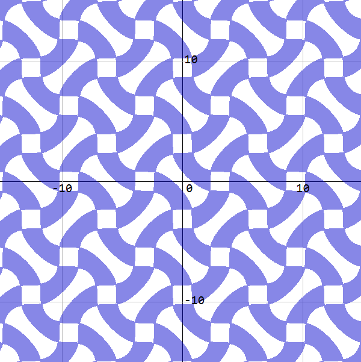
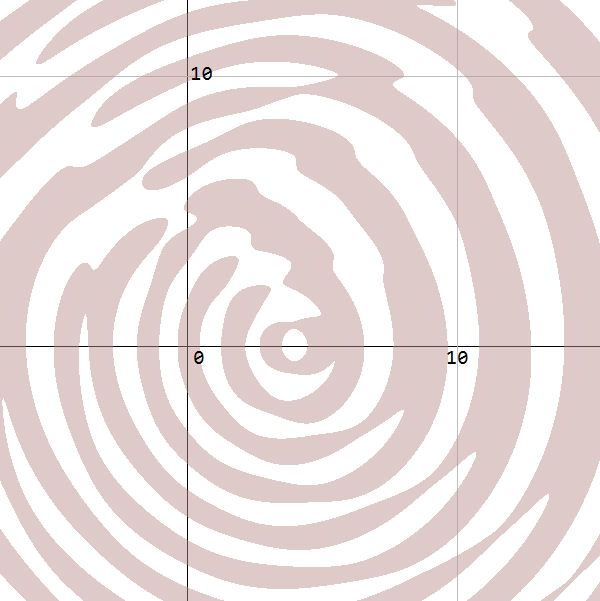
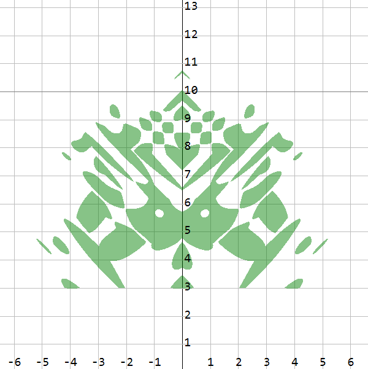

# CsGrafeq
## Description
A WinForm control that supports implicit function drawing \
CsGrafeq is a drawing application for drawing implicit functions with 2 variables. \
It's an open source alternative to Grafeq. \
CsGrafeq is based on Reliable Two-Dimensional Graphing Methods for Mathematical Formulae with Two Free Variables by Jeff Tupper of University of Toronto, SIGGRAPH 2001. \
It implements the Jeff Tupper's algorithms before Branch Cut Tracking or Algorithm 3.2. \
CsGrafeq uses GDI+ to render images on the screen, so there is no need to get any dependency.

## Feature
1. Zoom in and out of the coordinate axis with the mouse 
2. Compile the string form formula to speed up computation 
3. No dependency 

## Usage
Add expression to CsGrafeq control by 
```C#
yourCsGrafeq.ImpFuncs.Add("x+1<Log(y)-sin(x)/x")

//Or
using static CsGrafeq.ExpressionBuilder
//......
youtCsGrafeq.ImpFuncs.Add(x+1<Log(y)-Sin(x)/x)
```
The case in string expression is not distinguished.

## Example








\
[More examples](Example.md)
