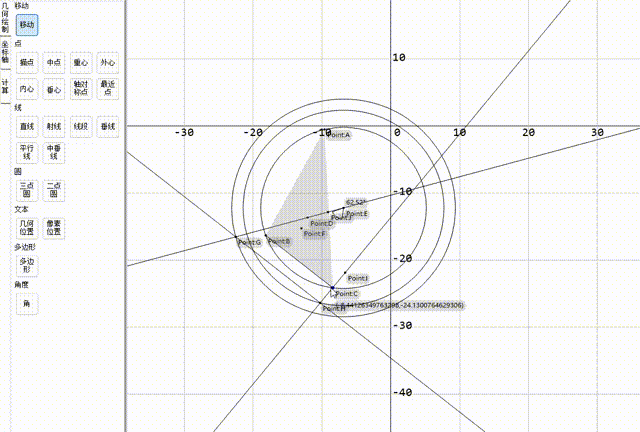

# CsGrafeq
## Description ¼ò½é
A geometry sketchpad that supports implicit function drawing and geometry drawing \

The implicit function plotting part of the sketchpad can draw implicit functions with 2 variables \
It's an open source alternative to Grafeq. \
It is based on Reliable Two-Dimensional Graphing Methods for Mathematical Formulae with Two Free Variables by Jeff Tupper of University of Toronto, SIGGRAPH 2001. \
It implements the Jeff Tupper's algorithms before Branch Cut Tracking or Algorithm 3.2. \

The sketchpad uses GDI+ to render images on the screen, so there is no need to get any dependency.

## Example

[See More](Example.md) \

\
[See More](Example.md)
