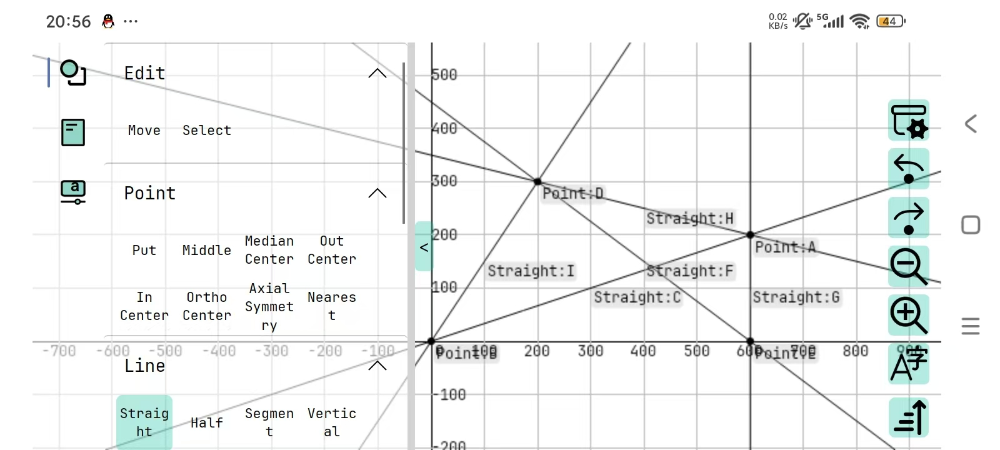
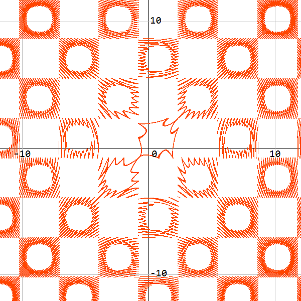

[Avalk(README.md)|[中文](README_ZH.md)

# CsGrafeq

## Description

CsGrafeq is a geometry sketchpad. It's made by Avalonia and use Material.Avalonia as its theme. For the sake that JIT is unavailable in mobile platforms and browser, CsGrafeq now only support Desktop (now only Windows). 

[Project](./OldVersion/README.md) in old version folder is for stably implicit function plotting. The function of Implicit function plotting
is being made now.

## Features

- ReadyToRun compiled, no .Net Runtime environment required.
- High quality function image plotting.
- Beautiful UI

## Future and Plan

### Short term plan

1. Add implicit function supports
2. Add text block supports
3. Implement custom msgbox/inputbox
4. Implement mathematical calculation (e.g. 0.5->1/2, 1.414->√2)

### Long term plan

1. Add more shapes supports
2. Fix bugs

Welcome to any programming enthusiasts who wish to collaborate on development. \
You can put forward your opinions and suggestions in [Issues](https://github.com/jyswjjgdwtdtj/CsGrafeq/issues), I will
reply as soon as possible. \
Due to the pressure of high school academic studies, I will engage in development during the winter and summer holidays.
Each of your stars🌟 is the motivation for my development. Thank you🙏😊.

## Function Example

These are the screenshot from old version, and new plots will be added.\

\
[See More](OldVersion/Example.md) 
