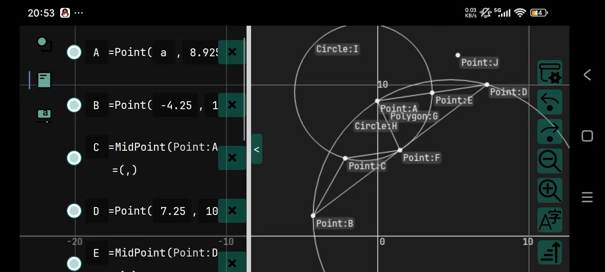

[English](README.md)|[中文](README_ZH.md)

# CsGrafeq

## Description

CsGrafeq is a geometry sketchpad. For the sake that JIT is unavailable in mobile platforms and browser, CsGrafeq now only support Windows. \
[Project](./OldVersion/README.md) in old version folder is for stably implicit function plotting. The function of Implicit function plotting
is being made now.\

## Features

ReadyToRun compiled, no .Net Runtime environment required.

## Future

1.Add implicit function supports

- Implement an micro interpreter to replace expression tree under AOT.

2.~~Add ctrl+z "undo"~~ Done \
3.Add ctrl+s "save"\
4.~~Add variable~~ Done\
5.~~Add trackbar to set value of variables~~ Done\
6.~~Add script supports~~ No planning, replaced by complete expression support\
7.Add text block supports\
8.Add more shapes supports\
9.~~New icon~~ Done

Welcome to any programming enthusiasts who wish to collaborate on development. \
You can put forward your opinions and suggestions in [Issues](https://github.com/jyswjjgdwtdtj/CsGrafeq/issues), I will
reply as soon as possible. \
Due to the pressure of high school academic studies, I will engage in development during the winter and summer holidays.
Each of your stars🌟 is the motivation for my development. Thank you🙏😊.

## Function Example

These are the screenshot from old version, and new plots will.be added.\

\
[See More](OldVersion/Example.md) 
