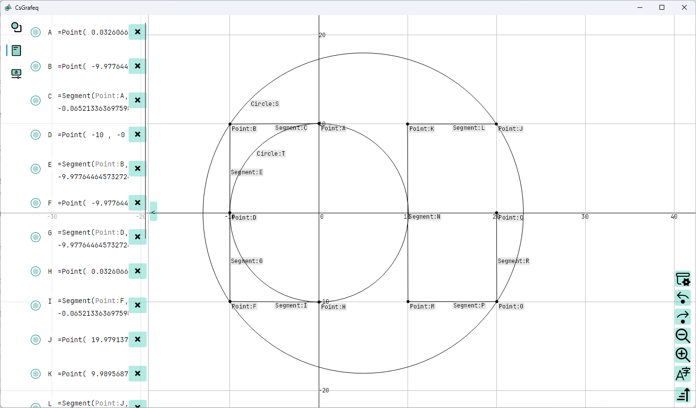

[English](README.md)|[中文](README_ZH.md)

# CsGrafeq


## Description

CsGrafeq is a geometry sketchpad. It's made by Avalonia and use Material.Avalonia as its theme. 

For the sake that JIT is unavailable in mobile platforms and browser, CsGrafeq now only support Desktop (now only Windows). 

[Project](./OldVersion/README.md) in old version folder is for stably implicit function plotting. Implicit function plotting is being made now.




## Features

- ReadyToRun compiled, no .Net Runtime environment required.
- High quality function image plotting.
- Beautiful UI

## Project Structure

```
CsGrafeq.sln
├─ CsGrafeqApplication (Application layer: Avalonia UI + multi-platform hosts)
│  ├─ CsGrafeqApplication: Main UI/feature assembly; aggregates core libs and UI resources (assets, controls, resource dictionaries)
│  ├─ CsGrafeqApplication.Core: Reusable UI controls and core interaction components (keyboard, markdown, shared controls) for the app/dialogs
│  ├─ CsGrafeqApplication.Dialogs: Dialog/message box module (View/ViewModel split), depends on Core + MVVM
│  ├─ CsGrafeqApplication.Desktop: Desktop host/entry point (Win/macOS/Linux packaging; WinExe)
│  ├─ CsGrafeqApplication.Android: Android host (net10.0-android)
│  ├─ CsGrafeqApplication.iOS: iOS host (net10.0-ios)
│  └─ CsGrafeqApplication.Browser: WebAssembly/browser host (net10.0-browser)
└─ CsGrafeq (Core libraries: algorithms, numeric, compiler, shared infrastructure)
   ├─ CsGrafeq.Base: Shared base infrastructure & common types/utilities (also brings core Avalonia/ReactiveUI dependencies)
   ├─ CsGrafeq.Numeric: Numeric + symbolic math utilities/wrappers (e.g., MathNet.Symbolics), foundation for compiler/interval computations
   ├─ CsGrafeq.Compiler: Expression/formula compilation & evaluation (symbolic + expression compiler), used by Interval/Shapes/App
   ├─ CsGrafeq.Interval: Interval arithmetic and interval set types (Interval/IntervalSet) + compiler integration for implicit equations
   ├─ CsGrafeq.Shapes: Shape/geometry models and related logic (depends on Interval/Compiler/Numeric/I18N, etc.)
   ├─ CsGrafeq.MVVM: MVVM support library (ReactiveUI-based shared ViewModel infrastructure), depends on I18N
   ├─ CsGrafeq.I18N: Internationalization/localization resources + binding support (configuration binding generator enabled)
   ├─ CsGrafeq.I18N.Generator: Roslyn source generator/analyzer for I18N (wired into I18N as an Analyzer)
   ├─ CsGrafeq.Windows: Windows-specific adaptation (Avalonia.Win32 and related platform glue)
   ├─ CsGrafeq.Debug: Debug/diagnostics helpers (Avalonia.Diagnostics, etc.) for development-time tooling
   └─ CsGrafeq.Keyboard: Keyboard-related shared library (key definitions/input helpers), used by Core/App

```

## Future and Plan

### Short term plan

- Add text block supports
- Implement custom msgbox/inputbox
- Implement symbolic calculation (e.g. 0.5->1/2, 1.414->√2)
- Implement custom formula editor
- achieve a complete separation between the UI thread and the image rendering thread.
- Implement GPU computing to accelerate calculations


### Long term plan

- Add more shapes supports
- Fix bugs
   - There are still cases where the drawing process gets stuck for no apparent reason.

Welcome to any programming enthusiasts who wish to collaborate on development. 

You can put forward your opinions and suggestions in [Issues](https://github.com/jyswjjgdwtdtj/CsGrafeq/issues), I will
reply as soon as possible. 

Due to the pressure of high school academic studies, I will engage in development during the winter and summer holidays.
Each of your stars🌟 is the motivation for my development. Thank you🙏😊.

## Function Example

These are the screenshot from old version.\


\
[See More](OldVersion/Example.md) 

## See Also
Software of the same type
 - [Graphest](https://github.com/unageek/graphest) - A faithful graphing calculator
 - [Grafeq](http://www.peda.com/grafeq/) - An intuitive, flexible, precise and robust program for producing graphs of implicit equations and inequalities.

 Papers
 - [Tup96] Jeffrey Allen Tupper. _Graphing Equations with Generalized Interval Arithmetic._ Master's thesis, University of Toronto, 1996. http://www.dgp.toronto.edu/~mooncake/thesis.pdf
 - [Tup01] Jeff Tupper. _Reliable Two-Dimensional Graphing Methods for Mathematical Formulae with Two Free Variables._ SIGGRAPH 2001 Conference Proceedings, 2001. http://www.dgp.toronto.edu/~mooncake/papers/SIGGRAPH2001_Tupper.pdf