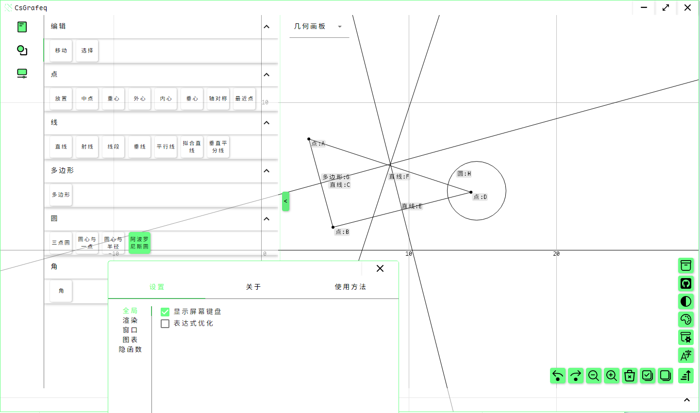

[English](README.md)|[中文](README_ZH.md)

# CsGrafeq


## 简介

CsGrafeq是一项用C#实现的开源几何画板，使用Avalonia作为UI框架，Material.Avalonia作为主题。

出于JIT在移动平台和浏览器中无法使用，CsGrafeq暂时只支持桌面端（目前仅支持Windows平台）

[旧版本项目](./OldVersion/README.md) 是专为隐函数制作的，这项功能将会在未来合并入CsGrafeq。





## 特点

- ReadyToRun 编译, 无需.NET环境
- 高质量隐函数绘图
- 流畅且美丽的UI

## 项目结构

```
CsGrafeq.sln
├─ CsGrafeqApplication（应用层：Avalonia 前端与多平台宿主）
│  ├─ CsGrafeqApplication：主 UI/业务程序集；聚合各核心库与界面资源（Assets、控件、资源字典等）
│  ├─ CsGrafeqApplication.Core：通用 UI 控件与核心交互组件（键盘、Markdown、可复用控件等），供主程序/对话框复用
│  ├─ CsGrafeqApplication.Dialogs：对话框/消息框等 UI 模块（View/ViewModel 分离），依赖 Core 与 MVVM
│  ├─ CsGrafeqApplication.Desktop：桌面端宿主（Win/macOS/Linux 打包入口，WinExe）
│  ├─ CsGrafeqApplication.Android：Android 宿主（net10.0-android）
│  ├─ CsGrafeqApplication.iOS：iOS 宿主（net10.0-ios）
│  └─ CsGrafeqApplication.Browser：WebAssembly/浏览器宿主（net10.0-browser）
└─ CsGrafeq（核心库：算法、数值、编译、通用基础设施）
   ├─ CsGrafeq.Base：基础设施与通用类型/工具（并引入 Avalonia/ReactiveUI 等基础依赖）
   ├─ CsGrafeq.Numeric：数值与符号计算相关封装（MathNet.Symbolics 等），为编译/区间/图形计算提供底座
   ├─ CsGrafeq.Compiler：表达式/公式编译与求值相关（含符号库/表达式编译器），向上供 Interval/Shapes/应用使用
   ├─ CsGrafeq.Interval：区间运算与区间集合（Interval/IntervalSet）及其编译联动，用于隐式方程等计算
   ├─ CsGrafeq.Shapes：图形/形状与渲染相关的模型与逻辑（依赖 Interval/Compiler/Numeric/I18N 等）
   ├─ CsGrafeq.MVVM：MVVM 支撑库（ReactiveUI 相关，共享 ViewModel 基础能力），依赖 I18N
   ├─ CsGrafeq.I18N：国际化/本地化资源与绑定（配置绑定生成开启），提供多语言资源访问
   ├─ CsGrafeq.I18N.Generator：I18N 的 Roslyn 源生成器/分析器（以 Analyzer 形式注入到 I18N）
   ├─ CsGrafeq.Windows：Windows 平台相关适配/Win32 依赖封装（Avalonia.Win32 等）
   ├─ CsGrafeq.Debug：调试/诊断相关组件（Avalonia.Diagnostics 等），用于开发期调试支持
   └─ CsGrafeq.Keyboard：键盘相关（可能是输入法/按键定义等的共享库，供 Core/应用引用）
```

## 计划

### 短期目标

- 添加文本框支持
- 实现原生MsgBox,InputBox
- 实现符号计算，替换浮点计算 (e.g. 0.5->1/2, 1.414->√2)
- 实现原生表达式编辑器

### 长期目标

- 添加更多图形支持 如向量，距离等
- 修复Bug

欢迎任何希望参与开发的朋友加入！

你可以把想法和建议包括bug反馈在[Issues](https://github.com/jyswjjgdwtdtj/CsGrafeq/issues), 也可加qq:3621206568和邮箱:bryanbryan123000@outlook.com，我会尽快回复。

出于学业压力的考虑，我会在寒暑假期间尽可能多地更新项目，平常时间可能会比较少。

你的每颗星星🌟都是支持我开发的动力！谢谢！

## 函数示例

以下是隐函数绘制示例\
详情移步[查看更多](OldVersion/Example.md) \


