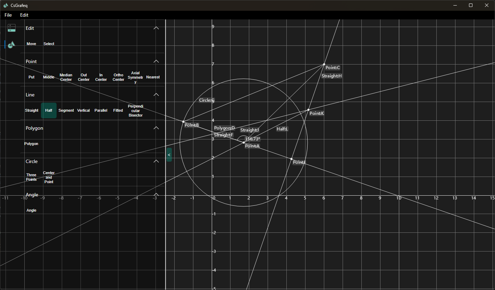
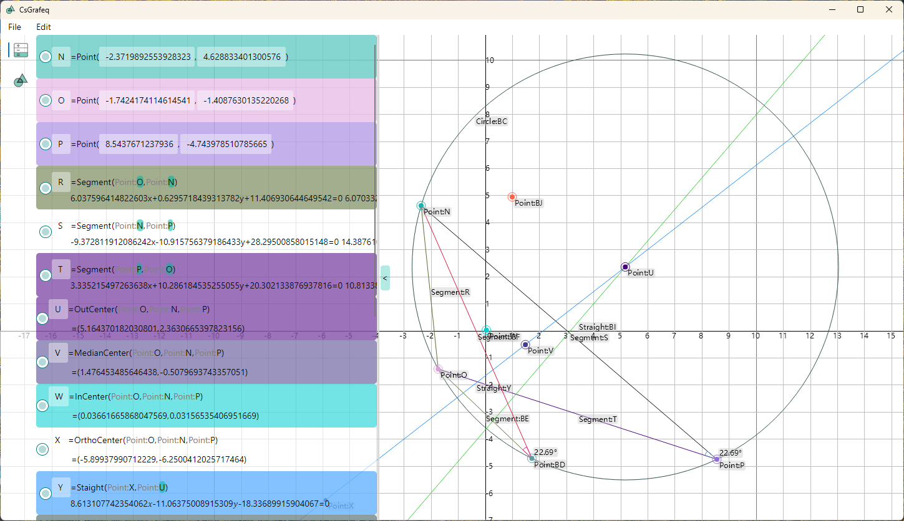
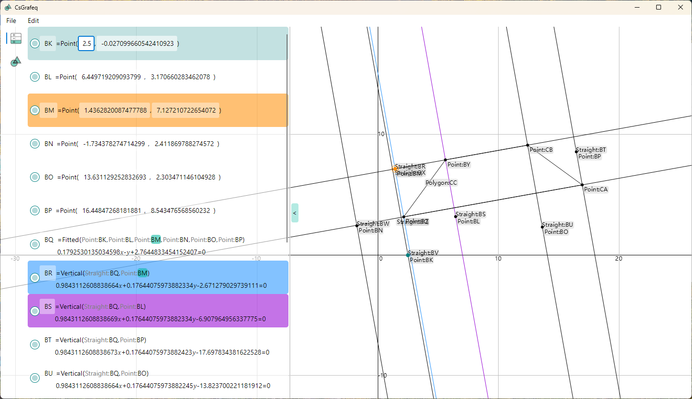

[English](README.md)|[中文](README_ZH.md)
# CsGrafeq

## 简介

CsGrafeq是一项用c#实现的开源几何画板。出于性能和跨平台需要的原因，隐函数绘制再CsGrafeq暂时不支持。\
[旧版本项目](./OldVersion/README.md) 是专为隐函数制作的，这项功能将会在未来合并入CsGrafeq。\
项目的可执行文件已经编译至[Publish](./Publish)文件夹，或者也可直接[下载]("https://wwzt.lanzoul.com/is26E349oheh")。

## 特点
使用AOT(Ahead Of Time)发布, 无需安装 dotNET Core 运行时，无需携带大量动态链接库

## 未来
1.增加隐函数支持\
2.支持 ctrl+z 撤销操作\
3.支持 ctrl+s 保存操作\
4.支持使用变量\
5.支持用于修改变量的滑动条以及其他控制\

## 示例

以下是隐函数绘制示例\

\
[查看更多](OldVersion/Example.md) 
