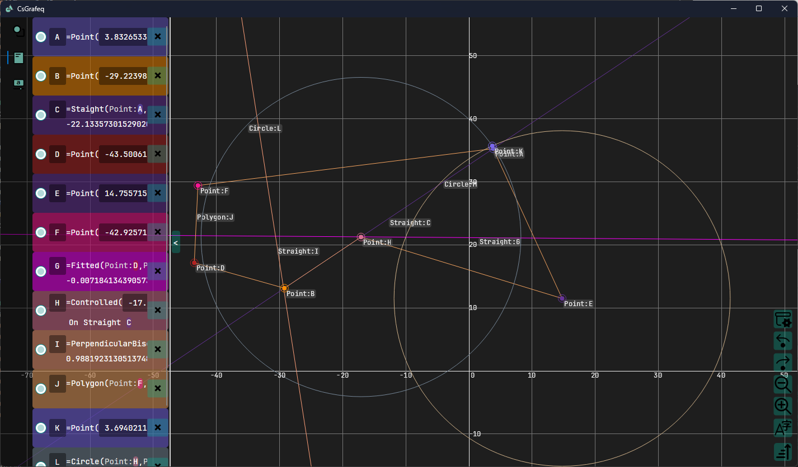

[English](README.md)|[中文](README_ZH.md)
# CsGrafeq

## 简介

CsGrafeq是一项用c#实现的开源几何画板。出于性能和跨平台需要的原因，隐函数绘制再CsGrafeq暂时不支持。\
[旧版本项目](./OldVersion/README.md) 是专为隐函数制作的，这项功能将会在未来合并入CsGrafeq。\

## 特点
使用AOT(Ahead Of Time)发布, 无需安装 dotNET Core 运行时，无需携带大量动态链接库

## 未来
1.增加隐函数支持
  - 实现一个微型解释器，代替表达式树作为执行隐函数的引擎 

2.~~支持 ctrl+z 撤销操作~~ 已完成\
3.支持 ctrl+s 保存操作\
4.~~支持使用变量~~ 已完成\
5.~~支持用于修改变量的滑动条以及其他控制~~ 已完成\
6.~~添加对脚本的支持~~ 暂时不准备实现 用更完善的表达式替代\
7.添加对文本的支持~~\
8.添加对更多图形的支持
9.~~新的图标~~ 已完成 

欢迎任何希望参与开发的朋友加入！\
你可以把想法和建议包括bug反馈在[Issues](https://github.com/jyswjjgdwtdtj/CsGrafeq/issues) 或者 [Discussions](https://github.com/jyswjjgdwtdtj/CsGrafeq/discussions), 也可加qq:3621206568和邮箱:bryanbryan123000@outlook.com，我会尽快回复。\
出于学业压力的考虑，我会在寒暑假期间尽可能多地更新项目，平常时间可能会比较少。\
你的每颗星星🌟都是支持我开发的动力！谢谢！

## 函数示例
以下是隐函数绘制示例\
详情移步[查看更多](OldVersion/Example.md) \

